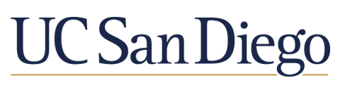

# Hi, Hola, 你好👋  This is [Yi Yao](https://balanced-detailed-parrotfish.glitch.me/YiYao.html) 

**MathCS  `UCSD`  [GitHub](https://github.com/yiy054)**

>EQUITY, DIVERSITY, AND INCLUSION

*I am a Senior Math-Computer Science major who is comfortable coding in multiple computer languages. I had the performing analysis in statistical packages with the R language.
I also have a lot of experience in teamwork for multiple group such as co-op projects and club organization at UCSD. I have strong communication and organizational skills.*

[Contact information](Contact.md)
[Fall 2022](#fall-2022)
[Summer 2022](#summer-2022)
[Spring 2022](#spring-2022)

### Fall 2022
- CSE 110
  1. [Lab week 0&1 ](https://github.com/yiy054/Lab-week0-1)
   - [ ] Individual Engineer Statement
- CSE 101
- CSE 151
- CSE 158
- MATH 181B

### Summer 2022
- ECE 45
- MATH 103A

### Spring 2022
- ECE 35
- MATH 102
- MATH 170B
- CSE 100
- CSE 140&140L